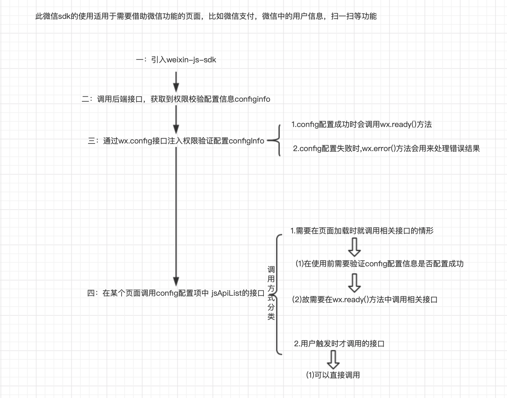

# 此处特指微信的分享，与微信下的其他功能一样，若想实现分享必须先接入wx-sdk
```js
// 流程图如下：

```
## 具体书写步骤可如下所示：
```js
// 1.引入JS文件
import wx from 'weixin-js-sdk'

// 2.通过调用后端接口来获取config配置信息，之所以暴露该方法是为了将该方法挂载在vue.prototype上然后全局执行
export async function wxInit () {
  return new Promise((resolve, reject) => {
    getJsApiConfig(0).then(res => {
      if (res.code === 0) {
        console.log('wxInit -> res', res)
        // 区分企业微信和微信呢场景下的config配置
        if (BxUtil.isQychart()) {
          loadJS('//res.wx.qq.com/open/js/jweixin-1.2.0.js', () => {
            onQyWxConfig(res.data, resolve)
          })
        } else {
            // 将配置信息注入config配置接口
          onWxConfig(res.data)
        }
      }
    })
  })
}

// 3.通过wx.config接口注入权限验证配置configInfo，是否配置成功的检验结果可以分别在wx.error()和w.ready()方法中知晓。wx.error()为配置失败时执行，wx.ready()为配置成功时执行
function onWxConfig (config, share) {
  wx.config({
    debug: false, // 开启调试模式,调用的所有api的返回值会在客户端alert出来，若要查看传入的参数，可以在pc端打开，参数信息会通过log打出，仅在pc端时才会打印。
    appId: config.appId, // 必填，公众号的唯一标识
    // appId: 'wx36ee943714067f6b', // 测试用
    timestamp: config.timestamp, // 必填，生成签名的时间戳，精确到秒
    nonceStr: config.nonceStr, // 必填，生成签名的随机串
    signature: config.signature, // 必填，签名
    jsApiList:[],
    openTagList: [
      'wx-open-launch-weapp', // 跳转小程序
      'wx-open-launch-app' // 跳转app
    ]
  })
  Vue.prototype.wx = wx
}

// 假设现在在SPA但页面中，并想要调用分享的接口。
created () {
    this.wxShare(this.shareInfo)
},
data () {
    return {
        shareInfo: {
            title: '',
            imgurl:''
        }
    }
}
methods: {
    // 可以将该方法封装在以上实现wx.config配置的文件中。
wxShare (shareInfo) {
  wx.ready(function (shareInfo) {
    // config信息验证通过后执行ready方法，所有接口的调用必须在config配置完成后执行。config是一个客户端的异步操作，所以如果需要在页面加载时就调用相关接口，
    // 则须把相关接口放在ready函数中调用来确保正确执行。对于用户触发时才调用的接口，则可以直接调用，不需要放在ready函数中
    // 分享到朋友圈
    wx.onMenuShareTimeline({
      title: '', // 分享标题,shareInfo.title
      link: '', // 分享链接,shareInfo.link
      imgUrl: '', // 分享图标,shareInfo.imgUrl
      success: function () {
        // 用户确认分享后执行的回调函数
        console.log('分享成功')
      },
      cancel: function () {
        // 用户取消分享后执行的回调函数
        console.log('取消分享')
      }
    })
    // 分享给朋友
    wx.onMenuShareAppMessage({
      title: '', // 分享标题
      desc: '', // 分享描述
      link: '', // 分享链接
      imgUrl: '', // 分享图标
      type: '', // 分享类型,music、video或link，不填默认为link
      dataUrl: '', // 如果type是music或video，则要提供数据链接，默认为空
      success: function () {
        // 用户确认分享后执行的回调函数
      },
      cancel: function () {
        // 用户取消分享后执行的回调函数
      }
    })
    // 分享到QQ
    wx.onMenuShareQQ({
      title: '', // 分享标题
      desc: '', // 分享描述
      link: '', // 分享链接
      imgUrl: '', // 分享图标
      success: function () {
        // 用户确认分享后执行的回调函数
      },
      cancel: function () {
        // 用户取消分享后执行的回调函数
      }
    })
  })
}
}
```