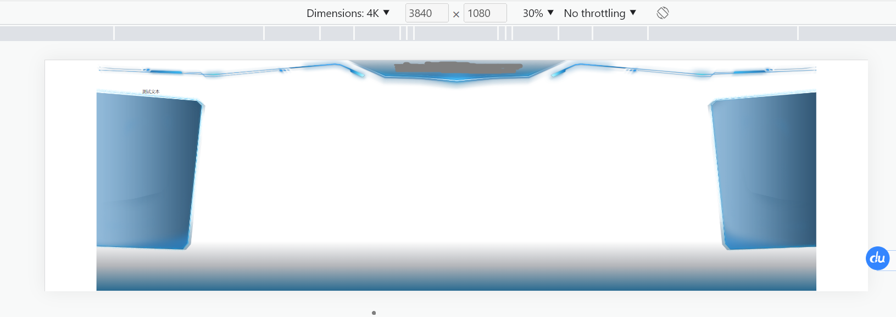
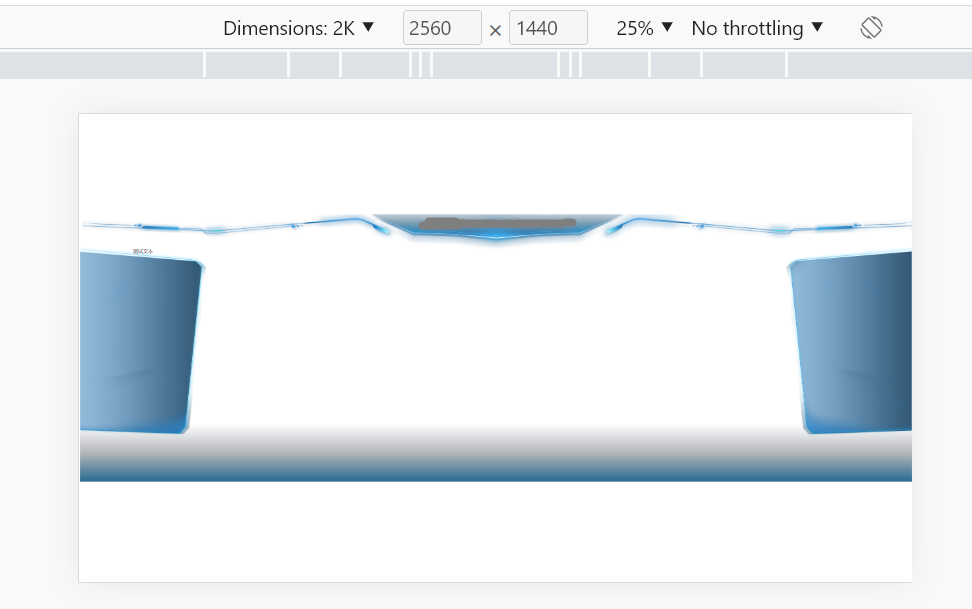

# 一：方案一：scale缩放模式
  此方案虽然适用于大部分尺寸屏幕，但是会产生白色空隙，因为缩放比例不同
  （1）假设现在设定屏幕尺寸为5040 * 1620
  那么在比它宽的屏幕上的显示效果为如下所示，出现两侧空白
  
  （2）假设 在比它高的屏幕上的显示效果为如下所示，出现上下空白
  
  ```js
    <template>
      <div id="app">
      </div>
    </template>

    <script>
    export default {
      name: 'App',
      mounted () {
        resize()
        // window.addEventListener('resize', resize)
      },
      beforeDestroy() {
        // window.removeEventListener('resize', this.resize);
      },
      methods:{
        resize () {
           const ww = window.innerWidth / w
            const wh = window.innerHeight / h
            return ww < wh ? ww : wh
        }
      }
    }
    </script>

    <style lang="scss" scoped>
    #app {
      // 设计稿宽高,不能是100%,因为100%的话会按照现有宽高进行缩放
      font-family: Avenir, Helvetica, Arial, sans-serif;
      -webkit-font-smoothing: antialiased;
      -moz-osx-font-smoothing: grayscale;
      text-align: center;
      width: 5040px; // 切记这里一定要给定一个尺寸
      height: 1620px;
      margin: 0 auto;
      position: absolute;
      top: 50%;
      left: 50%;
      transform-origin: 0 0; // 要将绝对定位和transform-origin和scale和translate一起使用
    }
    </style>

  ```
  ```js
    // ===========屏幕适配===========
    const screenRef = ref<HTMLDivElement | null>(null);

    function resize() {
      if (screenRef.value) {
        let { ww, wh } = getScale();
        screenRef.value.style.transform = `scale(${ww}, ${wh}) translate(-50%, -50%)`;
      }
    }
    // 根据浏览器大小缩放
    const getScale = (width = 1920, height = 1080) => {
      let ww = window.innerWidth / width;
      let wh = window.innerHeight / height;
      return { ww, wh };
    };

    onMounted(() => {
      if (screenRef.value) {
        let { ww, wh } = getScale();
        screenRef.value.style.transform = `scale(${ww}, ${wh}) translate(-50%, -50%)`;
        screenRef.value.style.width = `1920px`;
        screenRef.value.style.height = `1080px`;
      }
      window.addEventListener("resize", resize);
    });
    onBeforeUnmount(() => {
      window.removeEventListener("resize", resize);
      clearInterval(timer as unknown as number);
    });
  ```
# 方案二：vw,vh
  此方案同样适用于屏幕尺寸**比例跨度较小**的情况，且需要为每个元素写vw和vh函数,但是比如echarts中的文字只支持px不能使用vw,vh
  #### 第一步：添加项目依赖sass， sass-loader
  #### 第二步：新建styles/utils.scss文件
    ```js
      //使用scss的math函数，https://sass-lang.com/documentation/breaking-changes/slash-div
      @use "sass:math";

      $designWidth:1600; // 默认设计稿的宽度

      $designHeight:1200; // 默认设计稿的高度
      //px转为vw的函数
      @function vw($px) {
        @return math.div($px , $designWidth) * 100vw;
      }
      //px转为vh的函数
      @function vh($px) {
        @return math.div($px , $designHeight) * 100vh;
      }
    ```
  #### 第三步：全局配置css
    ```js
      css: {
          loaderOptions: {
          //全局配置utils.scss,详细配置参考vue-cli官网
            sass: {
              prependData: '@import "@/styles/utils.scss";',
            },
            less: {
              javascriptEnabled: true,
            },
          },
        },

      // 作者：hollyhuang
      // 链接：https://juejin.cn/post/7028853751423189022
    ```
  #### 第四步：使用
    ```js
      <style lang="scss" scoped="scoped">
        .chart-wrapper{
          width: vw(400);
          height: vh(300);
          font-size: vh(16);
          background-color: black;
          margin: vw(20);
          border: vh(2) solid red;
        }

      </style>
    ```
  https://juejin.cn/post/7009081081760579591#heading-27
  ```js
  // vue3自动将px转化为vw,vh的插件
  // 参考链接https://blog.csdn.net/Lyrelion/article/details/126901618
  // (1)pnpm install postcss-loader postcss-px-to-viewport -D
  // (2)在types文件夹下声明postcss-px-to-viewport.d.ts类型文件
  // (3)
  export default defineConfig({
  plugins: [vue(), vueJsx()],
  css: {
    postcss: {
      plugins: [
        postcsspxtoviewport({
          unitToConvert: 'px', // 要转化的单位
          viewportWidth: 750, // UI设计稿的宽度，一般写 320
    
          // 下面的不常用，上面的常用
          unitPrecision: 6, // 转换后的精度，即小数点位数
          propList: ['*'], // 指定转换的css属性的单位，*代表全部css属性的单位都进行转换
          viewportUnit: 'vw', // 指定需要转换成的视窗单位，默认vw
          fontViewportUnit: 'vw', // 指定字体需要转换成的视窗单位，默认vw
          selectorBlackList: ['ignore-'], // 指定不转换为视窗单位的类名，
          minPixelValue: 1, // 默认值1，小于或等于1px则不进行转换
          mediaQuery: true, // 是否在媒体查询的css代码中也进行转换，默认false
          replace: true, // 是否转换后直接更换属性值
          landscape: false // 是否处理横屏情况
        })
      ]
    }
  },

  ```
# 方案三：rem
(1)第一种方法：使用flexible.js和vscode的插件cssrem在编写代码的时候就将px转为rem.
(2)第二种方法
  [!方法一：利用vscode自身插件做px-->rem]https://blog.51cto.com/u_15715491/5464676
[!前端大屏可视化项目适配方案]https://blog.csdn.net/weixin_43552533/article/details/124167850?app_version=5.6.0&code=app_1562916241&csdn_share_tail=%7B%22type%22%3A%22blog%22%2C%22rType%22%3A%22article%22%2C%22rId%22%3A%22124167850%22%2C%22source%22%3A%22m0_67899841%22%7D&ctrtid=7zxT7&uLinkId=usr1mkqgl919blen&utm_source=app

# 问题一：方案对比：
当PC端的比例跨度较大时都会存在一定的问题，比如以下两个比例：1920* 1080，1920*1440
- scale方案会导致宽高出现空白，但是UI分布还能保持
- vw.vh方案因为参考尺寸的问题，会导致UI布局发生改变
# 问题二：echarts等字体，style行内样式字体不会转变为vw,vh问题
[!参考链接]https://blog.csdn.net/weixin_43552533/article/details/124167850?app_version=5.6.0&code=app_1562916241&csdn_share_tail=%7B%22type%22%3A%22blog%22%2C%22rType%22%3A%22article%22%2C%22rId%22%3A%22124167850%22%2C%22source%22%3A%22m0_67899841%22%7D&ctrtid=7zxT7&uLinkId=usr1mkqgl919blen&utm_source=app
[!大屏多弹窗管理方案]https://blog.csdn.net/qq_34998786/article/details/111566952